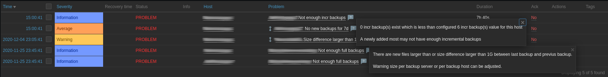
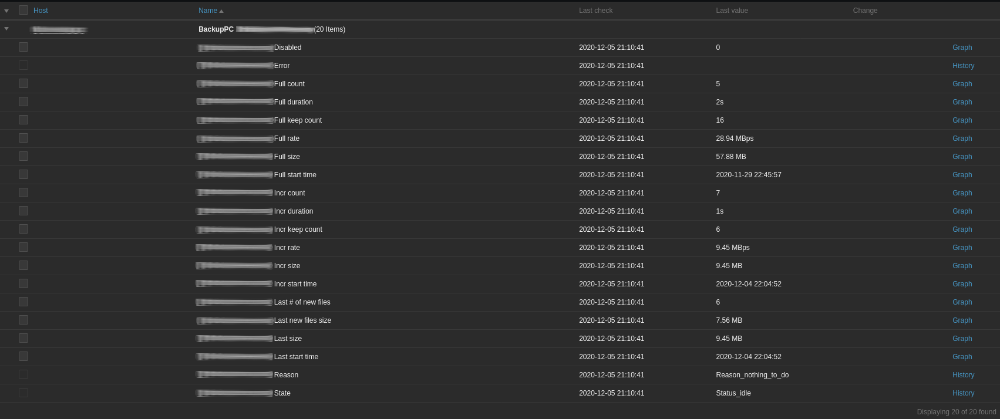
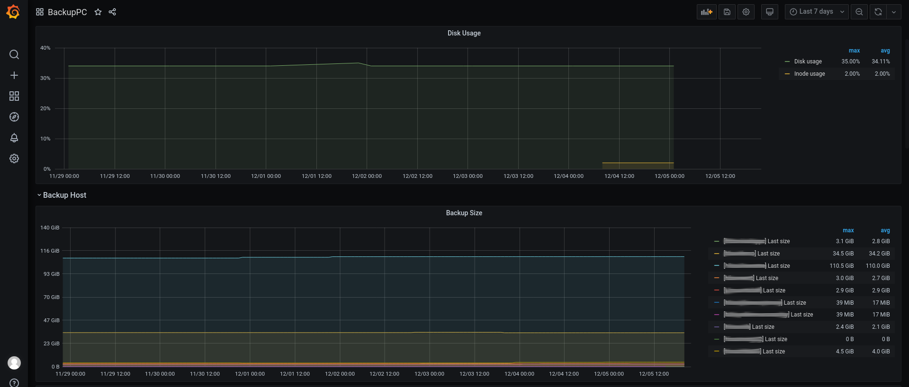
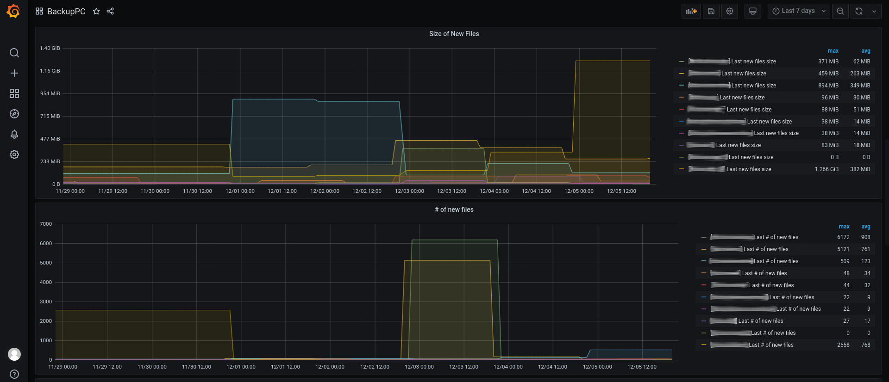
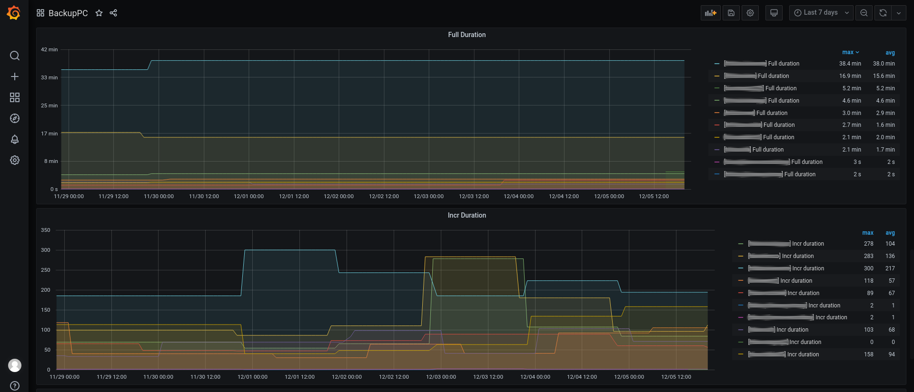

# Template App BackupPC by Zabbix agent

## Overview

For Zabbix version: 5.0 and higher also requires BackupPC 4.4.1 and higher. 
The template to monitor BackupPC by Zabbix that work without any external scripts.
The metrics are collected in one pass remotely using `web.page.get` and HTTP/HTTPS
Values are recevied from metrics API `?action=metrics`

Last backup and some metrics are detected using javascript.

This template was tested on:

- Zabbix, version 5.0
- BackupPC, version 4.4.1>

## Zabbix configuration

No specific Zabbix configuration is required.

### Macros used

Please read the descriptions in the template.

### Screenshots

